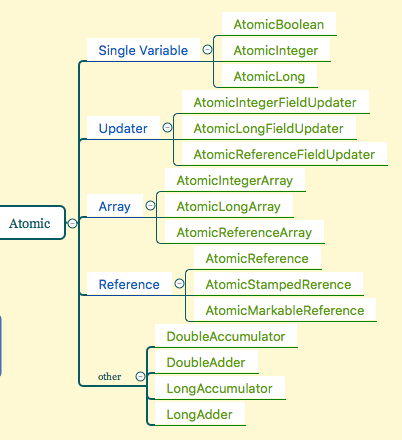

# Atomic 

### 概要

>1. Atomic包介绍
>2. CAS 介绍
>3. 基本类型解析以及使用
>4. 引用类型解析以及使用
>5. 数组类型解析以及使用
>6. 属性原子修改器(Updater)解析以及使用
>7. Java 8新增加的LongAdder等类的解析以及使用

### Atomic包介绍

>这个包主要是一个小型工具包，支持**单个变量**上的无锁线程安全编程。
>
>主要的类如下图
>
>
>
>其中other这一类是java 8中新增加的类，后面会介绍。
>
>虽然这包下面类很多，但是你只需要看懂其中一个，其余的方法和使用都是大同小异。

### CAS 介绍

>在讲解Atomic包下面具体类的使用，我们先了解一下什么是CAS，全称Compare-and-Swap，是指比较和交换，一种特殊的处理器指令。
>
>- CAS是乐观锁思想的一种实现，是为了保证一组比较替换操作原子性；当多个线程尝试使用CAS同时更新同一个变量时，只有其中一个线程能更新变量的值，而其它线程都失败， 失败的线程并不会被挂起，而是被告知这次竞争中失败，并可以再次尝试。
>- CAS乐观锁的实现与悲观锁的区别在于当资源不用的时候悲观锁会将线程挂起而CAS会继续重试直到资源可用；
>
>乐观锁的核心算法是CAS（Compareand Swap，比较并交换），它涉及到三个操作数：内存值、预期值、新值。当且仅当预期值和内存值相等时才将内存值修改为新值。这样处理的逻辑是，首先检查某块内存的值是否跟之前我读取时的一样，如不一样则表示期间此内存值已经被别的线程更改过，舍弃本次操作，否则说明期间没有其他线程对此内存值操作，可以把新值设置给此块内存。
>
>假如你足够细心你可能会发现一个疑问，比较和交换，从字面上就有两个操作了，更别说实际CAS可能会有更多的执行指令，他们是原子性的吗？如果非原子性又怎么保证CAS操作期间出现并发带来的问题？我是不是需要用上节提到的互斥锁来保证他的原子性操作？**CAS肯定是具有原子性的**，不然就谈不上在并发中使用了，**但这个原子性是由CPU硬件指令实现保证的**，即使用JNI调用native方法调用由C++编写的硬件级别指令，jdk中提供了Unsafe类执行这些操作。另外，你可能想着CAS是通过互斥锁来实现原子性的，这样确实能实现，但用这种方式来保证原子性显示毫无意义。
>
>其实Atomic包下面绝大部分的实现都是通过Unsafe这个类来实现的。全名为：sun.misc.Unsafe，这个类包含了大量的对C代码的操作，包括很多直接内存分配以及原子操作的调用，而它之所以标记为非安全的，是告诉你这个里面大量的方法调用都会存在安全隐患，需要小心使用，否则会导致严重的后果，例如在通过unsafe分配内存的时候，如果自己指定某些区域可能会导致一些类似C++一样的指针越界到其他进程的问题，不过它的具体使用并不是本文的重点，
>
>本文重点是Atomic系列的内容大多会基于unsafe类中的以下几个本地方法来操作：
>
>```Java
>public final native boolean 
>       compareAndSwapObject(Object paramObject1, long paramLong, 
>                              Object paramObject2, Object paramObject3); 
>
>public final native boolean 
>		compareAndSwapInt(Object paramObject,long paramLong,
>                          		int paramInt1, int paramInt2); 
>
>public final native boolean 
>			compareAndSwapLong(Object paramObject, long paramLong1, 
>                               		long paramLong2, long paramLong3);  
>```
>
>首先拿**compareAndSwapObject**这个函数来讲解一下大概的意思：
>
>**对象的引用进行对比后交换，交换成功返回true，交换失败返回false**，这个交换过程完全是原子的，在CPU上计算完结果后，都会对比内存的结果是否还是原先的值，若不是，则认为不能替换，因为变量是volatile类型所以最终写入的数据会被其他线程看到，所以一个线程修改成功后，其他线程就发现自己修改失败了。
>
>**参数1：**对象所在的类本身的对象（一般这里是对一个对象的属性做修改，才会出现并发，所以该对象所存在的类也是有一个对象的）
>
>**参数2：**这个属性在这个对象里面的相对便宜量位置，其实对比时是对比内存单元，所以需要属性的起始位置，而引用就是修改引用地址（根据OS、VM位数和参数配置决定宽度一般是4-8个字节），int就是修改相关的4个字节，而long就是修改相关的8个字节。
>
>获取偏移量也是通过unsafe的一个方法：objectFieldOffset(Fieldfield)来获取属性在对象中的偏移量；静态变量需要通过：staticFieldOffset(Field field)获取，调用的总方法是：fieldOffset(Fieldfield)
>
>**参数3：**修改的引用的原始值，用于对比原来的引用和要修改的目标是否一致。
>
>**参数4：**修改的目标值，要将数据修改成什么。
>
>其中要注意的是**对long的操作，要看VM是否支持对Long的CAS，因为有可能VM本身不支持，若不支持，此时运算会变成Lock方式，不过现在VM都基本是支持的而已。**
>
>#### CAS存在的问题(ABA)
>
>- CAS操作是进行比较替换，容易出现ABA问题；如果一个变量的初始值是A，一个线程准备将A改为了B，在这期间又有其他线程将A改回了B，又将B改回A，这个时候CAS会认为中间没有发生变化，实际上是已经是不同的这就出现了ABA问题；ABA问题的解决办法：JDK引入了解决ABA问题的Automic原子类AutomicStampedReference，使用时间戳版本号来进行标记；下面会介绍
>- 在高并发的情况下会出现CAS频繁碰撞，碰撞会造成赋值失败继续重试，越多线程重试，CAS失败几率又越高，变成恶性循环，造成效率底下等问题；

### 基本类型解析以及使用

>基本类型主要有以下三种类型：AtomicInteger、AtomicLong、AtomicBoolean；用法大体上差不多，因此这里就拿AtomicInteger类来讲解。
>
>我们直接来上代码，然后在解释
>
>```java
>import java.util.concurrent.CountDownLatch;
>import java.util.concurrent.atomic.AtomicInteger;
>
>public class AtomicIntegerTest {
>
>    public final static AtomicInteger TEST_INTEGER = new AtomicInteger(1);
>    
>    public static int test = 1;
>
>    public static void main(String[] args) throws InterruptedException {
>        AtomicTest();
>        intTest();
>        CountDownLatch cd = new CountDownLatch(1);
>
>
>    }
>
>    /**
>     * 最终打印的结果一定是：11
>     *
>     * @throws InterruptedException
>     */
>    public static void AtomicTest() throws InterruptedException {
>        Thread[] threads = new Thread[10];
>        CountDownLatch cd = new CountDownLatch(10);
>        for (int i = 0; i < 10; i++) {
>
>            final int num = i;
>
>            threads[i] = new Thread() {
>                public void run() {
>                    cd.countDown();
>                    try {
>
>                        cd.await();  //等待10 个线程创建成功
>
>                    } catch (InterruptedException e) {
>                        e.printStackTrace();
>                    }
>                    try {
>                        Thread.sleep(1000);
>                    } catch (InterruptedException e) {
>                        e.printStackTrace();
>                    }
>
>                    int now = TEST_INTEGER.incrementAndGet();
>                  
>                }
>            };
>            threads[i].start();
>        }
>        for (Thread t : threads) {
>            t.join();
>        }
>        System.out.println("AtomicTest最终运行结果：" + TEST_INTEGER.get());
>    }
>
>    /**
>     * 普通int测试。最终打印的结果不确定
>     *
>     * @throws InterruptedException
>     */
>    public static void intTest() throws InterruptedException {
>        Thread[] threads = new Thread[10];
>        CountDownLatch cd = new CountDownLatch(10);
>        for (int i = 0; i < 10; i++) {
>
>            final int num = i;
>
>            threads[i] = new Thread() {
>                public void run() {
>                    cd.countDown();
>                    try {
>
>                        cd.await();  //等待10 个线程创建成功
>
>                    } catch (InterruptedException e) {
>                        e.printStackTrace();
>                    }
>                    try {
>                        Thread.sleep(1000);
>                    } catch (InterruptedException e) {
>                        e.printStackTrace();
>                    }
>                    int now = ++test;
>                }
>            };
>
>            threads[i].start();
>        }
>        for (Thread t : threads) {
>            t.join();
>        }
>
>        System.out.println("intTest最终运行结果：" + test);
>    }
>}
>```
>
>上面的例子模拟多个线程并发对**AtomicInteger**和**普通变量**进行增加的操作，对AtomicInteger对象进行增加操作，最后得到的结果一定是11，但是对普通变量int类型的修改，得到的值不确定，可以为8，也可以为9，结果不确定。这个说明AtomicInteger是线程安全的，而普通的变量不是线程安全的。
>
>AtomicInteger的主要方法如下，使用和上面使用**incrementAndGet**方法差不多
>
>```
>//构造函数
>AtomicInteger()  //初始值为0
>AtomicInteger(int initivalValue)  //初始值为initivalValue
>
>int addAndGet(int delta) // 当前值加上delta,然后返回最总结果
>int	getAndAdd(int delta) // 返回当前值，然后加上delta
>
>//下面俩个方法其实是一样的效果，就是当前值为expect就设置当前值为value
>boolean compareAndSet(int expect,int value)
>boolean	weakCompareAndSet(int expect, int update)
>
>int	decrementAndGet() //相当于 --i
>int	incrementAndGet() //相当于 ++i
>int	getAndDecrement() //相当于 i--
>int	getAndIncrement() //相当于 i++
>
>//设置当前值为newValue
>void	set(int newValue)
>int	getAndSet(int newValue)  //得到当前值，并设置当前值为newVlaue
>void	lazySet(int newValue) //最终设置当前值为newValue，
>
>//下面几个方法都是返回当前值
>double	doubleValue()
>float	floatValue()
>long	longValue()
>int	intValue()
>int	get()
>
>
>//java 8新增加的方法，其中Function都要求无副作用的函数，
>int	updateAndGet(IntUnaryOperator updateFunction)
>int	getAndUpdate(IntUnaryOperator updateFunction)
>int	getAndAccumulate(int x, IntBinaryOperator accumulatorFunction)
>int	accumulateAndGet(int x, IntBinaryOperator accumulatorFunction)
>```
>
>下面讲解一下上面比较容易弄混的函数
>
>#### compareAndSet 和weakCompareAndSet 对比
>
>>主要的区别可以看看[对 volatile、compareAndSet、weakCompareAndSet 的一些思考](http://www.importnew.com/27596.html)
>
>#### lazySet
>
>>为一个AtomicLong对象设置一个值，jvm会确保其他线程读取到最新值，原子类和voliatile变量也是一样的，这是由依赖于硬件的系统指令(如x86的xchg)实现的。lazySet却是无法保证这一点的方法，所以其他线程在之后的一小段时间里还是可以读到旧的值。
>>
>>**这有什么好处呢？**
>>
>>**性能**：在多核处理器下，内存以及cpu缓存的读和写常常是顺序执行的，所以在多个cpu缓存之间同步一个内存值的代价是很昂贵的。
>
>另外俩个基本类型的原子类和AtomicInteger差不多，唯一的区别可能就是类型的不同。所以这里就不具体讲解。
>
>

### 引用类型解析以及使用

>引用类型主要包含以下几种：AtomicReference、AtomicStampedRerence、AtomicMarkableReference；
>
>首先讲解：AtomicReference
>
>直接上代码演示操作
>
>```Java
>import java.util.concurrent.atomic.AtomicReference;  
>  
>public class AtomicReferenceTest {  
>  
>    public final static AtomicReference<String> ATOMIC_REFERENCE =
>                new AtomicReference<String>("abc");  
>      
>    public static void main(String []args) {  
>        for(int i = 0 ; i < 100 ; i++) {  
>            final int num = i;  
>            new Thread() {  
>                public void run() {  
>                    try {  
>                        Thread.sleep(Math.abs((int)(Math.random() * 100)));  
>                    } catch (InterruptedException e) {  
>                        e.printStackTrace();  
>                    }  
>                    
>                    if(ATOMIC_REFERENCE.compareAndSet("abc", new String("abc"))) {  
>                        System.out.println("我是线程：" + num + 
>                                           ",获得了锁进行了对象修改！");  
>                    }  
>                }  
>            }.start();  
>        }  
>    }  
>}  
>//这个结果应该只打印一次
>```
>
>下面讲解一下为什么会出现AtomicStampedRerence和AtomicMarkableReference；这俩个类。
>
>这就要引出CAS会出现的一个问题，上面讲解了一下什么是ABA问题，这里在来重复讲解什么是ABA问题呢，当某些流程在处理过程中是顺向的，也就是不允许重复处理的情况下，在某些情况下导致一个数据由A变成B，再中间可能经过0-N个环节后变成了A，此时A不允许再变成B了，因为此时的状态已经发生了改变，例如：银行资金里面做一批账目操作，要求资金在80-100元的人，增加20元钱，时间持续一天，也就是后台程序会不断扫描这些用户的资金是否是在这个范围，但是要求增加过的人就不能再增加了，如果增加20后，被人取出10元继续在这个范围，那么就可以无限套现出来，就是ABA问题了，类似的还有抢红包或中奖，比如每天每个人限量3个红包，中那个等级的奖的个数等等。
>
>下面一个例子是ABA问题的简单演示：
>
>```
>
>import java.util.concurrent.atomic.AtomicReference;  
>  
>/** 
> * ABA问题模拟，线程并发中，导致ABA问题，解决方案是使用|AtomicMarkableReference 
> * 请参看相应的例子：AtomicStampedReferenceTest、AtomicMarkableReferenceTest 
> * 
> */  
>public class AtomicReferenceABATest {  
>      
>    public final static AtomicReference <String>ATOMIC_REFERENCE = new AtomicReference<String>("abc");  
>  
>    public static void main(String []args) {  
>        for(int i = 0 ; i < 100 ; i++) {  
>            final int num = i;  
>            new Thread() {  
>                public void run() {  
>                    try {  
>                        Thread.sleep(Math.abs((int)(Math.random() * 100)));  
>                    } catch (InterruptedException e) {  
>                        e.printStackTrace();  
>                    }  
>                    if(ATOMIC_REFERENCE.compareAndSet("abc" , "abc2")) {  
>                        System.out.println("我是线程：" + num + 
>                                 ",我获得了锁进行了对象修改！");  
>                    }  
>                }  
>            }.start();  
>        }  
>        new Thread() {  
>            public void run() {  
>                while(!ATOMIC_REFERENCE.compareAndSet("abc2", "abc"));  
>                System.out.println("已经改为原始值！");  
>            }  
>        }.start();  
>    }  
>}
>```
>
>代码中和原来的例子，唯一的区别就是最后增加了一个线程让他将数据修改为原来的值，并一直尝试修改，直到修改成功为止。
>
>**此时我们得到的结果是:**
>
>```
>我是线程：41,我获得了锁进行了对象修改！
>已经改为原始值！
>我是线程：85,我获得了锁进行了对象修改！
>```
>
>当然你的线程编号多半和我不一样,但是最后结果都会差不多，可以发现，有两个线程修改了这个字符串，我们是想那一堆将abc改成abc2的线程仅有一个成功，即使其他线程在他们运行时将引用值修改为abc，也不能再修改。
>
>下面来讲解如何来解决这个问题，此时我们需要使用的方式就不是简单的compareAndSet操作，因为它仅仅是考虑到物理上的并发，而不是在业务逻辑上去控制顺序，此时我们需要借鉴数据库的事务序列号的一些思想来解决，假如每个对象修改的次数可以记住，修改前先对比下次数是否一致再修改，那么这个问题就简单了，AtomicStampedReference类正是提供这一功能的，其实它仅仅是在AtomicReference类的再一次包装，里面增加了一层引用和计数器，其实是否为计数器完全由自己控制，大多数我们是让他自增的，你也可以按照自己的方式来标示版本号，
>
>此时我们通过类来AtomicStampedReference解决这个问题：
>
>```java
>import java.util.concurrent.atomic.AtomicStampedReference;  
>  
>public class AtomicStampedReferenceTest {  
>      
>    public final static AtomicStampedReference <String>ATOMIC_REFERENCE = 
>           new AtomicStampedReference<String>("abc" , 0);  
>      
>    public static void main(String []args) {  
>        for(int i = 0 ; i < 100 ; i++) {  
>            final int num = i;  
>            final int stamp = ATOMIC_REFERENCE.getStamp();  
>            new Thread() {  
>                public void run() {  
>                    try {  
>                        Thread.sleep(Math.abs((int)(Math.random() * 100)));  
>                    } catch (InterruptedException e) {  
>                        e.printStackTrace();  
>                    }  
>                    if(ATOMIC_REFERENCE.compareAndSet("abc" , "abc2" ,
>                    			stamp , stamp + 1)) {  
>                        System.out.println("我是线程：" + num + 
>                        			",我获得了锁进行了对象修改！");  
>                    }  
>                }  
>            }.start();  
>        }  
>        new Thread() {  
>            public void run() {  
>                int stamp = ATOMIC_REFERENCE.getStamp();  
>                while(!ATOMIC_REFERENCE.compareAndSet("abc2", "abc" , 
>                			stamp , stamp + 1));  
>                System.out.println("已经改回为原始值！");  
>            }  
>        }.start();  
>    }  
>}
>```
>
>此时再运行程序看到的结果就是我们想要的了，发现将abc修改为abc2的线程仅有一个被访问，虽然被修改回了原始值，但是其他线程也不会再将abc改为abc2。因为我们在修改引用对象时，会首先检测版本号是不是相同的，也就是当前**stamp**是不是和给定的相同，如果不同即使引用对象相同也不修改。这样就避免了ABA问题。
>
>**AtomicMarkableReference**和**AtomicStampedReference**功能差不多，有点区别的是：它描述更加简单的是与否的关系，通常ABA问题只有两种状态，而**AtomicStampedReference**是多种状态，那么为什么还要有**AtomicMarkableReference**呢，因为它在处理是与否上面更加具有可读性，而**AtomicStampedReference**过于随意定义状态，并不便于阅读大量的是和否的关系，它可以被认为是一个计数器或状态列表等信息，java提倡通过类名知道其意义，所以这个类的存在也是必要的，它的定义就是将数据变换为true|false如下：
>
>```Java
>public final static AtomicMarkableReference <String>ATOMIC_MARKABLE_REFERENCE = 
>        new AtomicMarkableReference<String>("abc" , false);
>```
>
>操作时使用
>
>```
>ATOMIC_MARKABLE_REFERENCE.compareAndSet("abc", "abc2", false, true);
>```
>
>
>
>

### 数组类型解析以及使用

>数组原子类型主要有这几个类：AtomicIntegerArray、AtomicLongArray、AtomicReferenceArray
>
>下面是AtomicIntegerArray的一个测试例子：
>
>```java
>import java.util.concurrent.atomic.AtomicIntegerArray;  
>  
>public class AtomicIntegerArrayTest {  
>  
>    /** 
>     * 常见的方法列表 
>     * @see AtomicIntegerArray#addAndGet(int, int) 执行加法，第一个参数为数组的下标，第二个参数为增加的数量，返回增加后的结果 
>     * @see AtomicIntegerArray#compareAndSet(int, int, int) 对比修改，参数1：数组下标，参数2：原始值，参数3，修改目标值，修改成功返回true否则false 
>     * @see AtomicIntegerArray#decrementAndGet(int) 参数为数组下标，将数组对应数字减少1，返回减少后的数据 
>     * @see AtomicIntegerArray#incrementAndGet(int) 参数为数组下标，将数组对应数字增加1，返回增加后的数据 
>     *  
>     * @see AtomicIntegerArray#getAndAdd(int, int) 和addAndGet类似，区别是返回值是变化前的数据 
>     * @see AtomicIntegerArray#getAndDecrement(int) 和decrementAndGet类似，区别是返回变化前的数据 
>     * @see AtomicIntegerArray#getAndIncrement(int) 和incrementAndGet类似，区别是返回变化前的数据 
>     * @see AtomicIntegerArray#getAndSet(int, int) 将对应下标的数字设置为指定值，第二个参数为设置的值，返回是变化前的数据 
>     */  
>    private final static AtomicIntegerArray ATOMIC_INTEGER_ARRAY = new AtomicIntegerArray(new int[]{1,2,3,4,5,6,7,8,9,10});  
>      
>    public static void main(String []args) throws InterruptedException {  
>        Thread []threads = new Thread[100];  
>        for(int i = 0 ; i < 100 ; i++) {  
>            final int index = i % 10;  
>            final int threadNum = i;  
>            threads[i] = new Thread() {  
>                public void run() {  
>                    int result = ATOMIC_INTEGER_ARRAY.addAndGet(index, index + 1);  
>                    System.out.println("线程编号为：" + 
>                                       threadNum + " , 对应的原始值为：" + 
>                                        (index + 1) + "，增加后的结果为：" + result);  
>                }  
>            };  
>            threads[i].start();  
>        }  
>        for(Thread thread : threads) {  
>            thread.join();  
>        }  
>        System.out.println("=========================>\n执行已经完成，结果列表：");  
>        for(int i = 0 ; i < ATOMIC_INTEGER_ARRAY.length() ; i++) {  
>            System.out.println(ATOMIC_INTEGER_ARRAY.get(i));  
>        }  
>    }  
>} 
>```
>
>计算结果说明：100个线程并发，每10个线程会被并发修改数组中的一个元素，也就是数组中的每个元素会被10个线程并发修改访问，每次增加原始值的大小，此时运算完的结果看最后输出的敲好为原始值的11倍数，和我们预期的一致，如果不是线程安全那么这个值什么都有可能。
>
>而相应的类：**AtomicLongArray**其实和**AtomicIntegerArray**操作方法类似，最大区别就是它操作的数据类型是long；而AtomicRerenceArray也是这样,只是他操作的是对象，没有了自增和自减这些操作。
>
>
>
>

### 属性原子修改器(Updater)解析以及使用

>Atomic系列是为你定义好的一些对象，你可以使用，但是如果是别人已经在使用的对象会原先的代码需要修改为Atomic系列，此时若全部修改类型到对应的对象相信很麻烦，因为牵涉的代码会很多，此时java提供一个外部的Updater可以对对象的属性本身的修改提供类似Atomic的操作，也就是它对这些普通的属性的操作是并发下安全的，分别由：**AtomicIntegerFieldUpdater、AtomicLongFieldUpdater、AtomicReferenceUpdater**，这样操作后，系统会更加灵活，也就是可能那些类的属性只是在某些情况下需要控制并发，很多时候不需要，但是他们的使用通常有以下几个限制：
>
>**限制1：**操作的目标**不能是static**类型，前面说到unsafe的已经可以猜测到它提取的是非static类型的属性偏移量，如果是static类型在获取时如果没有使用对应的方法是会报错的，而这个Updater并没有使用对应的方法。
>
>**限制2：**操作的目标**不能是final**类型的，因为final根本没法修改。
>
>**限制3：必须是volatile**类型的数据，也就是数据本身是读一致的。
>
>**限制4：**属性必须对当前的**Updater所在的区域是可见的**，也就是**private**如果不是当前类肯定是不可见的，**protected**如果不存在父子关系也是不可见的，**default**如果不是在同一个**package**下也是不可见的。
>
>**实现方式：**通过反射找到属性，对属性进行操作，但是并不是设置accessable，所以必须是可见的属性才能操作。
>
>```
>import java.util.concurrent.atomic.AtomicIntegerFieldUpdater;  
>  
>public class AtomicIntegerFieldUpdaterTest {  
>  
>    static class A {  
>        volatile int intValue = 100;  
>    }  
>      
>    /** 
>     * 可以直接访问对应的变量，进行修改和处理 
>     * 条件：要在可访问的区域内，如果是private或挎包访问default类型以及非父亲类的protected均无法访问到 
>     * 其次访问对象不能是static类型的变量（因为在计算属性的偏移量的时候无法计算），也不能是final类型的变量（因为根本无法修改），必须是普通的成员变量 
>     *  
>     * 方法（说明上和AtomicInteger几乎一致，唯一的区别是第一个参数需要传入对象的引用） 
>     * @see AtomicIntegerFieldUpdater#addAndGet(Object, int) 
>     * @see AtomicIntegerFieldUpdater#compareAndSet(Object, int, int) 
>     * @see AtomicIntegerFieldUpdater#decrementAndGet(Object) 
>     * @see AtomicIntegerFieldUpdater#incrementAndGet(Object) 
>     *  
>     * @see AtomicIntegerFieldUpdater#getAndAdd(Object, int) 
>     * @see AtomicIntegerFieldUpdater#getAndDecrement(Object) 
>     * @see AtomicIntegerFieldUpdater#getAndIncrement(Object) 
>     * @see AtomicIntegerFieldUpdater#getAndSet(Object, int) 
>     */  
>    public final static AtomicIntegerFieldUpdater <A>ATOMIC_INTEGER_UPDATER = AtomicIntegerFieldUpdater.newUpdater(A.class, "intValue");  
>      
>    public static void main(String []args) {  
>        final A a = new A();  
>        for(int i = 0 ; i < 100 ; i++) {  
>            final int num = i;  
>            new Thread() {  
>                public void run() {  
>                    if(ATOMIC_INTEGER_UPDATER.compareAndSet(a, 100, 120)) {  
>                        System.out.println("我是线程：" + num + 
>                        				" 我对对应的值做了修改！");  
>                    }  
>                }  
>            }.start();  
>        }  
>    }  
>}  
>```
>
>此时你会发现只有一个线程可以对这个数据进行修改，其他的方法如上面描述一样，实现的功能和AtomicInteger类似。
>
>而**AtomicLongFieldUpdater**其实也是这样，区别在于它所操作的数据是long类型。
>
>**AtomicReferenceFieldUpdater**方法较少，主要是**compareAndSet**以及**getAndSet**两个方法的使用，它的定义比数字类型的多一个参数如下：
>
>```java
>static class A {  
>    volatile String stringValue = "abc";  
>}  
>  
>AtomicReferenceFieldUpdater <A ,String>ATOMIC_REFERENCE_FIELD_UPDATER =    AtomicReferenceFieldUpdater.newUpdater(A.class, String.class, "stringValue");  
>```
>
>

### Java 8新增加的LongAdder等类的解析以及使用

>DoubleAccumulator、LongAccumulator、DoubleAdder、LongAdder是JDK1.8新增的部分，是对AtomicLong等类的改进。
>
>在CAS介绍那一节已经介绍了CAS存在的问题，前面解决了ABA问题，单丝还有一个问题没解决，就是在高并发的情况下会出现CAS频繁碰撞，碰撞会造成赋值失败继续重试，越多线程重试，CAS失败几率又越高，变成恶性循环，造成效率底下等问题；
>
>为了解决AutomicInteger等原子操作类在高并发下的性能问题，JDK8添加了LongAdder和DoubleAdder高并发增强原子类，其基本思想就是对于多个线程对同一个变量操作不相互排斥，而是保存每个线程对变量的修改，在读取变量的时候进行汇总，这样就不会造成线程间的互斥和重试，极大提高想并发性能；
>
>```
>//主要API
>
>//构造函数
>LongAdder()
>    //创建初始和为零的新加法器。
>
>//方法摘要
>void    add(long x)
>    //添加给定的值。
>void    decrement()
>    //相当于add(-1)。
>double  doubleValue()
>    //在扩展原始转换之后返回sum()as double。
>float   floatValue()
>    //在扩展原始转换之后返回sum()as float。
>void    increment()
>    //相当于add(1)。
>int intValue()
>    //返回sum()作为int一个基本收缩转换之后。
>long    longValue()
>    //相当于sum()。
>void    reset()
>    //重置将总和保持为零的变量。
>long    sum()
>    //返回当前的总和。
>long    sumThenReset()
>    //等同于sum()后面的效果reset()。
>String  toString()
>    //返回。的字符串表示形式sum()。
>```
>
>**实现原理：**
>
>LongAdder继承了Striped64类，来实现累加功能的,它是实现高并发累加的工具类； 
>
>* Striped64的设计核心思路就是通过内部的分散计算来避免竞争。 
>* Striped64内部包含一个base和一个Cell[] cells数组，又叫hash表。 
>* 没有竞争的情况下，要累加的数通过cas累加到base上；如果有竞争的话，会将要累加的数累加到Cells数组中的某个cell元素里面。所以整个Striped64的值为sum=base+∑[0~n]cells。
>
>LongAdder这样的处理方式是有坏处的，分段操作必然带来空间上的浪费，可以空间换时间；
>
>AtomicInteger和LongAdder的速度关系是： 低并发时LongAdder和AtomicLong性能差不多，高并发时LongAdder更高效


