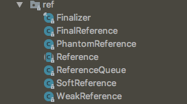
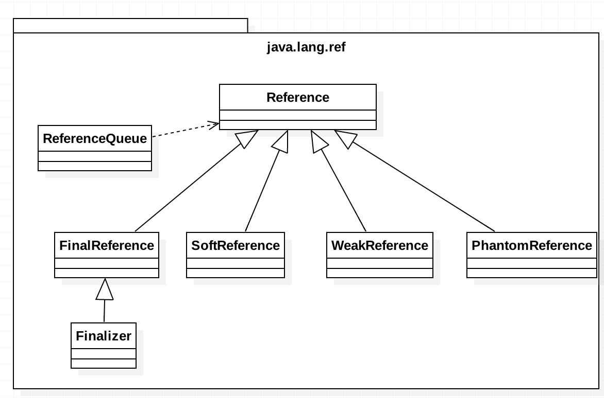

# 深入探讨 Java.lang.ref包

### 概述

>Java.lang.ref 是 Java 类库中比较特殊的一个包，它提供了与 Java 垃圾回收器密切相关的引用类。这些引用类对象可以指向其它对象，但它们不同于一般的引用，因为它们的存在并不防碍 Java 垃圾回收器对它们所指向的对象进行回收。其好处就在于使者可以保持对使用对象的引用，同时 JVM 依然可以在内存不够用的时候对使用对象进行回收。因此这个包在用来实现与缓存相关的应用时特别有用。同时该包也提供了在对象的“可达”性发生改变时，进行提醒的机制。本文通过对该包进行由浅入深的介绍与分析，使读者可以加深对该包的理解，从而更好地利用该包进行开发。
>
>1. Java.lang.ref 包介绍
>2. 各种引用的特性及用法
>3. finalize方法介绍

### Java.lang.ref包介绍

>首先来看一下Java.lang.ref这个包的结构，如图1所示
>
>
>
>​							图1 java.lang.ref 包结构
>
>图2 java.lang.ref包中类的继承关系
>
>
>
>​								图2 java.lang.ref包中继承关系

### 2. 各种引用的用法即特性

>#### 1. StrongReference
>
>>我们都知道 JVM 中对象是被分配在堆（heap）上的，当程序运行中不再有引用指向这个对象时，这个对象就可以被垃圾回收器所回收。这里所说的引用也就是我们一般意义上申明的对象类型的变量（如 String, Object, ArrayList 等），区别于原始数据类型的变量（如 int, short, long 等）也称为强引用。
>>
>>通常我们使用的引用大部分都是强引用，这也是我们见的最多的引用
>>
>>```
>>String tag = new String("dd");  //这就是一个强引用
>>```
>>
>>此处的 tag 引用就称之为强引用。而强引用有以下特征：
>>
>>- 强引用可以直接访问目标对象。
>>- 强引用所指向的对象在任何时候都不会被系统回收。
>>- 强引用可能导致内存泄漏。
>
>#### 2. SoftReference
>
>>软引用SoftReference 所指向的对象，当没有强引用指向它时，会在内存中停留一段的时间，垃圾回收器会根据 JVM 内存的使用情况（内存的紧缺程度）以及 SoftReference 的 get() 方法的调用情况来决定是否对其进行回收。
>>
>>具体使用一般是通过 SoftReference 的构造方法，将需要用弱引用来指向的对象包装起来。当需要使用的时候，调用 SoftReference 的 get() 方法来获取。当对象未被回收时 SoftReference 的 get() 方法会返回该对象的强引用。如下：
>>
>>#### 使用示例
>>
>>```java
>>package ref;
>>
>>import java.lang.ref.ReferenceQueue;
>>import java.lang.ref.SoftReference;
>>
>>/**************************************
>> *      Author : zhangke
>> *      Date   : 2018/3/31 22:08
>> *      Desc   : 软引用示例学习
>> *
>> *     软引用：当内存不足时才会被GC，当内存还有空间
>> *           不会被GC
>> *     vm options:-Xmx2M -Xms1M
>> *
>> *     由于线程需要一部分内存空间初始化，所以真正
>> *     的内存空间剩余不足2M
>> *
>> ************************************/
>>public class SoftReferenceTest {
>>
>>    final static int m = 1024 * 1024;
>>    final static int k = 1024;
>>
>>
>>    static ReferenceQueue<byte[]> rq = new ReferenceQueue<>(); //用于记录被GC回收的对象
>>
>>    public static void main(String[] args) {
>>
>>        SoftRefTest();
>>        SoftRefTest2();
>>        StrongRefTest();
>>
>>    }
>>
>>    /**
>>     * 当内存不足新对象所需空间时
>>     * SoftReference对象的测试
>>     */
>>    public static void SoftRefTest() {
>>        System.out.println("SoftRefTest");
>>
>>        //下面这句代码申请了 500 kb内存，当内存不足时会被回收
>>        SoftReference<byte[]> bufferRef = new SoftReference<>(new byte[500 * k], rq);
>>        //这句代码会接着申请500 kb内存，但是由于内存总共才2，所以内存不够，就会把上面的对象给回收了，
>>        //注意：2M内存，由于其他的原因，实际可使用的最大内存是不到2M的
>>        byte[] bu = new byte[500 * k];
>>        //由于内存不足，所以软引用会被回收
>>        System.out.println(bufferRef.get() == null); // 如果bufferRef被回收了，get返回null
>>        System.out.println(bufferRef.isEnqueued());  //bufferRef已经进入了指定的队列，也就是rq
>>        System.out.println(rq.poll() == bufferRef);  //判断队列里面是否有刚才入队的对象
>>
>>
>>    }
>>
>>    /**
>>     * 当内存满足新对象所需空间时
>>     * SoftReference对象的测试
>>     */
>>    public static void SoftRefTest2() {
>>        System.out.println("SoftRefTest2");
>>
>>        //下面这句代码申请了 500 kb内存，当内存不足时会被回收
>>        SoftReference<byte[]> bufferRef = new SoftReference<>(new byte[500 * k], rq);
>>
>>        System.gc(); //执行GC
>>
>>        //由于内存还足够使用，所以软引用不会回收
>>        System.out.println(bufferRef.get() == null); // 如果bufferRef被回收了，get返回null
>>        System.out.println(bufferRef.isEnqueued());  //bufferRef是否进入了指定的队列，也就是rq
>>        System.out.println(rq.poll() == bufferRef);  //判断队列里面是否有刚才入队的对象
>>
>>
>>    }
>>
>>    /**
>>     * StrongReference的测试
>>     */
>>    public static void StrongRefTest() {
>>        System.out.println("StrongRefTest");
>>        // 首先创建一个需要500 k内存的对象，这是强引用
>>        byte[] n1 = new byte[500 * k];
>>
>>        //接着申请一个需要600 kb内存的对象，这也是强引用，
>>        //由于内存不足，所以下面会 OOM错误
>>        byte[] n2 = new byte[600 * k];
>>
>>
>>    }
>>}
>>```
>>
>>上面的示例演示了SoftReference的具体用法。同时也对比了强引用下内存不足时和存软引用下内存不足时产生的结果。强引用直接抛出OOM错误，软引用则通过回收内存来增加可用内存，从而满足空间的申请，当内存空间还不足时就抛出错误。还演示了软引用的具体回收情形。只要内存不是太紧张时，软引用就不会被回收。
>>
>>软引用有以下特征：
>>
>>- 软引用使用 get() 方法取得对象的强引用从而访问目标对象。
>>- 软引用所指向的对象按照 JVM 的使用情况（Heap 内存是否临近阈值）来决定是否回收。
>>- 软引用可以避免 Heap 内存不足所导致的异常。
>>
>>当垃圾回收器决定对其回收时，会先清空它的 SoftReference，也就是说 SoftReference 的 get() 方法将会返回 null，然后再调用对象的 finalize() 方法，并在下一轮 GC 中对其真正进行回收。
>
>#### WeakReference
>
>>弱引用的特性和基本与软引用相似，区别就在于弱引用所指向的对象只要进行系统垃圾回收，不管内存使用情况如何，永远对其进行回收（get() 方法返回 null）。
>>
>>#### 使用示例
>>
>>```
>>package ref;
>>
>>import java.lang.ref.ReferenceQueue;
>>import java.lang.ref.WeakReference;
>>
>>/**************************************
>> *      Author : zhangke
>> *      Date   : 2018/3/31 23:55
>> *      Desc   : 弱引用测试
>> *      vm options:-Xmx2M -Xms1M
>> *
>> *     由于线程需要一部分内存空间初始化，所以真正
>> *     的内存空间剩余不足2M
>> ***************************************/
>>public class WeakReferencesTest {
>>
>>    final static int m = 1024 * 1024;
>>    final static int k = 1024;
>>
>>    //用于记录被GC回收的对象
>>    static ReferenceQueue<byte[]> rq = new ReferenceQueue<>(); 
>>
>>    public static void main(String[] args) {
>>        weakRefTest();
>>    }
>>
>>    /**
>>     * 弱引用测试函数，只要发生GC，弱引用包含的
>>     * 对象都会被回收
>>     */
>>    public static void weakRefTest() {
>>        //创建弱引用对象，后面的ReferenceQueue可以不需要，
>>        //在这里只是为记录弱引用被收回了
>>        WeakReference<byte[]> wf = new WeakReference<>(new byte[500 * k], rq);
>>        
>>        System.gc(); //执行GC
>>        
>>        System.out.println(wf.get() == null); //true
>>        System.out.println(wf.isEnqueued()); //true
>>        //false 因为已经进入队列了，如果没有直行G，这句话就是true
>>        System.out.println(wf.enqueue());
>>
>>        //当前只进去一个对象，所以为true,
>>        System.out.println(rq.poll() == wf);
>>
>>    }
>>}
>>```
>>
>>上面的示例演示了弱引用的使用。当执行GC之后，所有的弱引用就会被回收。与软引用不同的是，软引用只有在内存不足时才会回收。
>>
>>弱引用有以下特征：
>>
>>- 弱引用使用 get() 方法取得对象的强引用从而访问目标对象。
>>- 一旦系统内存回收，无论内存是否紧张，弱引用指向的对象都会被回收。
>>- 弱引用也可以避免 Heap 内存不足所导致的异常。
>
>#### PhantomReference
>
>>不同于软引用和弱引用，虚引用无法通过 get() 方法来取得目标对象的强引用从而使用目标对象，观察源码可以发现 get() 被重写为永远返回 null。
>>
>>那虚引用到底有什么作用？其实虚引用主要被用来 **跟踪对象被垃圾回收的状态**，通过查看引用队列中是否包含对象所对应的虚引用来判断它是否 **即将**被垃圾回收，从而采取行动。它并不被期待用来取得目标对象的引用，而目标对象被回收前，它的引用会被放入一个 ReferenceQueue 对象中，从而达到跟踪对象垃圾回收的作用。
>>
>>所以具体用法和之前两个有所不同，它必须传入一个 ReferenceQueue 对象。当虚引用所引用对象被垃圾回收后，虚引用会被添加到这个队列中。如：
>>
>>#### 使用示例
>>
>>```JAVA
>>package ref;
>>
>>import java.lang.ref.PhantomReference;
>>import java.lang.ref.ReferenceQueue;
>>
>>/**************************************
>> *      Author : zhangke
>> *      Date   : 2018/4/1 00:07
>> *      Desc   : 虚引用测试
>> *
>> *      虚引用的唯一作用就是他可以检测到对象的死亡，即当你的对象
>> *      真正的从内存中移除时，指向这个对象的PhantomReference就会被加入到
>> *      队列中。
>> ***************************************/
>>public class PhantomReferenceTest {
>>    public static void main(String[] args) {
>>
>>        ReferenceQueue<String> refQueue = new ReferenceQueue<String>();
>> 
>>        PhantomReference<String> referent = new PhantomReference<String>(
>>                new String("t"), refQueue);
>>     
>>        System.out.println(referent.get());// null
>>
>>        System.gc();
>>        System.runFinalization();  //尽最大努力GC
>>
>>        System.out.println(refQueue.poll() == referent); //true
>>    }
>>}
>>
>>```
>>
>>值得注意的是，对于引用回收方面，虚引用类似强引用不会自动根据内存情况自动对目标对象回收，Client 需要自己对其进行处理以防 Heap 内存不足异常。
>>
>>虚引用有以下特征：
>>
>>- 虚引用永远无法使用 get() 方法取得对象的强引用从而访问目标对象。
>>- 虚引用所指向的对象在被系统内存回收前，虚引用自身会被放入 ReferenceQueue 对象中从而跟踪对象垃圾回收。
>>- 虚引用不会根据内存情况自动回收目标对象。
>
>另外值得注意的是，其实 SoftReference, WeakReference 以及 PhantomReference 的构造函数都可以接收一个 ReferenceQueue 对象。当 SoftReference 以及 WeakReference 被清空的同时，也就是 Java 垃圾回收器准备对它们所指向的对象进行回收时，调用对象的 finalize() 方法之前，它们自身会被加入到这个 `ReferenceQueue 对象`中，此时可以通过 ReferenceQueue 的 poll() 方法取到它们。而 PhantomReference 只有当 Java 垃圾回收器对其所指向的对象真正进行回收时，会将其加入到这个 `ReferenceQueue 对象`中，这样就可以追综对象的销毁情况。
>
>### 各种引用类型总结：
>
>| **引用类型** | **取得目标对象方式** | **垃圾回收条件** | **是否可能内存泄漏** |
>| ------------ | -------------------- | ---------------- | -------------------- |
>| 强引用       | 直接调用             | 不回收           | 可能                 |
>| 软引用       | 通过 get() 方法      | 视内存情况回收   | 不可能               |
>| 弱引用       | 通过 get() 方法      | 永远回收         | 不可能               |
>| 虚引用       | 无法取得             | 不回收           | 可能                 |
>
>##注意
>
>如果想使用这些相对强引用来说较弱的引用来进行对象操作的时候，就必须保证没有强引用指向被操作对象。否则将会被视为强引用指向，不会具有任何的弱引用的特性。
>
>如下所示：
>
>```
>String t = new String("t");
>WeakReference<String> wf = new WeakReference<>(t);
>System.gc(); //无论怎样执行，上面的t对象都不会被回收
>
>//如果是下面这样就会被回收
>WeakReference<String> wf = new WeakReference<>(t);
>t = null;  //相当于告诉虚拟机不存在 new String("t")对象的引用
>System.gc(); //上面的t对象会被回收
>```
>
>### 补充：ReferenceQueue
>
>>```
>>Reference queues, to which registered reference objects are appended by the garbage collector after the appropriate reachability changes are detected.
>>```
>>
>>上面就是Java API给出的注释，简单的说ReferenceQueue就是负责记录GC回收的引用对象。
>>
>>如果在创建引用对象时绑定了一个引用队列对象，那么当这个引用对象被GC后，就会自动加入的这个队列。上面所有的案例里面都使用过这个类，所以就不在这里演示他是如何使用的
>
>

### finalize方法介绍

>在这一小节中，我让大家来看看Java中的finalize方法有多“不靠谱”。假设我现在有1个重写了finalize 方法的对象`obj`，它被收集的过程如下：
>
>1. 假设现在有足够多的垃圾使得JVM进行gc，并标记了`obj` 是不可达的
>2. 接着，它会把`obj` 放到finalization队列中，等待执行它的finalize 方法
>3. 如果执行完它的finalize方法，再次gc时才会把这个对象回收掉。**如果这个方法一直没有执行完，这个对象就一直不会被回收。**
>
>下面看一段demo:
>
>```java
>public class PhantomReferenceDemo2 {
>    private final static ReferenceQueue<Object> queue = new ReferenceQueue<>();
>
>    public static void main(String[] args) {
>        Person p = new Person();
>        PhantomReference<Person> pr = new PhantomReference<>(p, queue);
>        p = null; // 使Person对象变的不可达
>
>        // 这次gc会把Person对象标记为不可达的，由于它重写了finalize，
>        //因此它会被放入到finalization队列
>        Runtime.getRuntime().gc();
>        waitMoment(2000); // 给gc更多的时间去处理，并且去执行队列中的finalize方法
>        Runtime.getRuntime().gc(); // 再次发起gc，收集Person对象
>        waitMoment(2000); // 给gc更多的时间去处理
>        printReferenceQueue(queue); // 如果Person对象已经被回收，这个队列中应该有值
>    }
>
>    static class Person {
>        @Override
>        protected void finalize() throws Throwable {
>            System.out.println("finalize method in Person");
>        }
>    }
>
>    private static void waitMoment(long time) {
>        try {
>            Thread.sleep(time);
>        } catch (InterruptedException e) {
>            e.printStackTrace();
>        }
>    }
>
>    private static void printReferenceQueue(ReferenceQueue<Object> rq) {
>        int size = 0;
>        Object obj;
>        while ( ( obj = rq.poll() ) != null ) {
>            System.out.println(obj);
>            size++;
>        }
>        System.out.println("引用队列大小为： " + size);
>    }
>}
>```
>
>上面演示了用徐引用去监控Person对象的存活状态。
>
>下面演示如果当前要回收对象的finalize方法一直在执行，GC就回收不了这个对象。
>
>```Java
>public class PhantomReferenceDemo2 {
>    private final static ReferenceQueue<Object> queue = new ReferenceQueue<>();
>
>    public static void main(String[] args) {
>        BlockFinalization bf = new BlockFinalization();
>        PhantomReference<BlockFinalization> prbf = 
>               new PhantomReference<>(bf, queue);
>        bf = null; // 使BlockFinalization对象变的不可达
>       // 我让BlockFinalization对象中的finalize方法睡了1000秒，
>        //这样会导致主线程即使结束，finalize方法也不会执行完
>        Runtime.getRuntime().gc();
>
>        Person p = new Person();
>        PhantomReference<Person> pr = new PhantomReference<>(p, queue);
>        p = null; // 使Person对象变的不可达
>
>        // 这次会把Person对象放入到finalization队列
>        Runtime.getRuntime().gc();
>        waitMoment(2000);
>        Runtime.getRuntime().gc();
>        waitMoment(2000);
>    // 如果这2个对象中的finalize方法不被执行完，它们都不会被回收，根据队列输出的值就可以看出来了
>        printReferenceQueue(queue);
>    }
>
>    static class BlockFinalization {
>        @Override
>        protected void finalize() throws Throwable {
>            System.out.println("finalize method in BlockFinalization");
>            Thread.sleep(1000000);
>        }
>    }
>}
>```
>
>**另外我在infoq上面看到一篇讲finalize很好的文章:[**JVM源码分析之FinalReference完全解读**](http://www.infoq.com/cn/articles/jvm-source-code-analysis-finalreference)**


